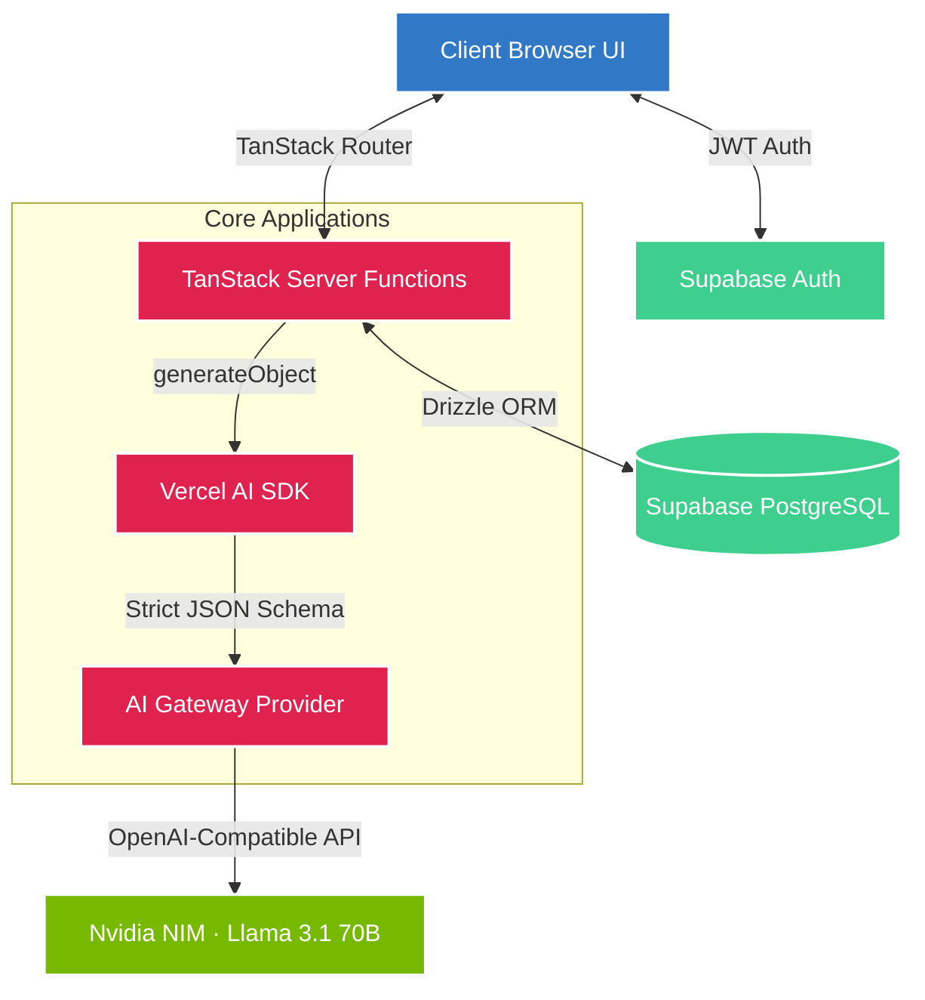

<div align="center">

# 🕵️‍♂️ ML Inspector Suite

**The AI Engineer's QA Platform — audit, debug, test, and document LLM & RAG systems in one place.**

[](LICENSE)
[](https://react.dev)
[](https://www.typescriptlang.org)
[](https://developer.nvidia.com/nim)
[](https://tanstack.com/start)
[](https://supabase.com)

<br/>

> Most teams ship AI systems without knowing why they break.  
> ML Inspector Suite is built to change that.

<br/>

[**Explore the Tools**](#-core-tools) · [**Architecture**](#-system-architecture) · [**Getting Started**](#-getting-started) · [**Tech Stack**](#-tech-stack)

</div>

---

## 🧭 What Is This?

ML Inspector Suite is a **unified platform for AI/ML engineers** who need more than vibes to validate their systems.

Whether you're debugging a RAG pipeline that hallucinates, writing model documentation that nobody reads, or trying to understand why your prompts fail on edge cases — this suite gives you the structured, reproducible tooling that should have existed years ago.

Built on **TanStack Start** with **Nvidia NIM (Llama 3.1 70B)** as the reasoning backbone, every tool in this suite uses a judge LLM with strict JSON Schema outputs — so results are structured, comparable, and automatable, not just vibes from a chat window.

---

## 🏗️ System Architecture

The application runs on a modern SSR architecture. AI workloads are routed through a unified AI Gateway to Nvidia NIM using structured JSON Schema — no free-form LLM responses, every output is typed and validated with Zod before it reaches the UI.



**Key architectural decisions:**

- **Structured outputs only** — every LLM call uses `generateObject` with Zod schemas. No string parsing, no regex hacks.
- **Server functions** — AI workloads run server-side via TanStack Server Functions, keeping API keys off the client.
- **Supabase for persistence** — results, reports, and audit history are stored per-user so nothing is lost between sessions.
- **OpenAI-compatible gateway** — swap Nvidia NIM for any compatible provider by changing one env variable.

---

## ✨ Core Tools

### 🔍 1. RAG Debugger
> *Find exactly where your retrieval pipeline broke.*

Paste a query, your retrieved context chunks, and the final model response. The judge LLM evaluates grounding score, hallucination risk, chunk relevance, and retrieval miss rate — then tells you whether the failure was in chunking, embedding, retrieval, or synthesis.

**Use when:** your RAG answers are wrong and you can't tell if it's a retrieval problem or a generation problem.

---

### 📝 2. Model Card Generator
> *Go from "I trained a model" to a complete HuggingFace-compatible Model Card in under 60 seconds.*

Describe your model in plain language — task, dataset, architecture, eval metrics, limitations. The suite generates a fully structured Model Card following the HuggingFace/Google Model Card spec, ready to paste into your repo or submit for compliance review.

**Use when:** you need to document a model and don't want to spend two hours staring at a blank Markdown template.

---

### 🧪 3. Prompt Regression Tester
> *Unit testing for prompts. Finally.*

Define test cases as `(input → expected output)` pairs. Write multiple prompt variants. Run them all through the LLM, score each response against expected output using an LLM judge, and get a ranked comparison table. Catch prompt regressions before they hit production.

**Use when:** you're iterating on system prompts and need to know whether the new version is actually better.

---

### 🏆 4. Multi-Model Benchmarker
> *Stop guessing which model to use. Measure it.*

Run the same benchmark suite across multiple models (Llama 3.1, Gemini, Claude, etc.) and compare reasoning quality, latency, and cost side by side. Configurable eval dimensions — factual accuracy, instruction following, output format adherence.

**Use when:** you're choosing between models for a production use case and need data, not benchmarks written by the model vendors.

---

### 🔪 5. Chunking Strategy Simulator
> *See how your chunking decisions affect retrieval before you commit to them.*

Test Fixed-size, Sliding Window, Sentence-level, and Paragraph chunking strategies on your actual documents. Visualize chunk boundaries, compare retrieval hit rates per strategy, and pick the one that actually works for your content.

**Use when:** you're building a RAG pipeline and don't know which chunking strategy to use.

---

### ⚖️ 6. Bias Auditor
> *Surface what your dataset is hiding.*

Upload a CSV or JSON dataset and the suite runs statistical fairness checks across demographic attributes, detects hidden correlations, flags toxic outputs, and generates a plain-English audit report. Built for engineers and non-technical PMs alike.

**Use when:** you need to validate a dataset before training or deploying, or when a stakeholder asks "is this model fair?"

---

### 💸 7. LLM Cost Estimator
> *Know your token bill before it hits your credit card.*

Input your use case parameters — token counts, request volume, latency requirements — and get a projected cost breakdown across providers with a cost/quality tradeoff analysis. Includes RAG-specific cost modeling for chunking and embedding.

**Use when:** you're scoping a production AI feature and need a budget estimate that isn't a wild guess.

---

### 📊 8. Audit Report Generator
> *One-click compliance documentation for your AI system.*

Combine results from the Bias Auditor, Model Card Generator, and Prompt Tester into a single downloadable PDF report — structured for enterprise AI governance, safety reviews, and regulatory submissions. Boardroom-ready output from engineering inputs.

**Use when:** you need to demonstrate AI system accountability to a non-technical stakeholder, legal team, or compliance officer.

---

## 🚀 Getting Started

### Prerequisites

- Node.js 22+ (or Bun)
- A [Supabase](https://supabase.com) project (free tier works)
- An [Nvidia API Key](https://developer.nvidia.com/nim) for NIM access

### Environment Setup

Create a `.env` file in the root:

```env
VITE_SUPABASE_URL=your_supabase_project_url
VITE_SUPABASE_ANON_KEY=your_supabase_anon_key
OPENAI_API_KEY=your_nvidia_nim_api_key
```

> `OPENAI_API_KEY` is used with the OpenAI-compatible Nvidia NIM endpoint. The variable name is intentional.

### Install & Run

```bash
# Install dependencies
npm install

# Start the development server
npm run dev
```

Navigate to `http://localhost:5173` — all 8 tools are available from the dashboard.

### Database Setup

```bash
# Push the Drizzle schema to your Supabase instance
npm run db:push
```

---

## 🛠️ Tech Stack

| Layer | Technology |
|---|---|
| Framework | TanStack Start (React 19 + SSR) |
| Language | TypeScript 5.x |
| AI SDK | Vercel AI SDK (`generateObject`) |
| LLM Provider | Nvidia NIM — `meta/llama-3.1-70b-instruct` |
| Database | Supabase (PostgreSQL) |
| ORM | Drizzle ORM |
| Auth | Supabase Auth (JWT) |
| Styling | TailwindCSS v4 + Radix UI Primitives |
| Validation | Zod + zod-to-json-schema |
| Deployment | Vercel (recommended) |

---

## 📁 Project Structure

```
ml-inspector-suite/
├── app/
│   ├── routes/                 # TanStack Router file-based routes
│   │   ├── index.tsx           # Dashboard
│   │   ├── rag-debugger/
│   │   ├── model-cards/
│   │   ├── prompt-tester/
│   │   ├── benchmarks/
│   │   ├── chunking-simulator/
│   │   ├── bias-auditor/
│   │   ├── cost-estimator/
│   │   └── audit-reports/
│   ├── server/
│   │   ├── functions/          # TanStack Server Functions (AI workloads)
│   │   ├── db/                 # Drizzle schema + Supabase client
│   │   └── ai/                 # Zod schemas + NIM gateway config
│   └── components/             # Shared UI components (Radix + Tailwind)
├── .env
└── package.json
```

---

## 🗺️ Roadmap

- [ ] PII detection in datasets before RAG ingestion
- [ ] Real-time model output drift detection
- [ ] Team workspaces with shared audit history
- [ ] Fine-tuning readiness checker
- [ ] GDPR / EU AI Act compliance checklist generator
- [ ] GitHub Actions integration for CI-based prompt regression tests
- [ ] Embedding model comparator (OpenAI vs Cohere vs BGE)

---

## 🤝 Contributing

Pull requests are welcome. For major changes, open an issue first to discuss what you'd like to change.

```bash
git clone https://github.com/your-username/ml-inspector-suite
cd ml-inspector-suite
npm install
npm run dev
```

---

## 📄 License

MIT — see [LICENSE](LICENSE) for details.

---

<div align="center">

Built by engineers who were tired of debugging AI systems with print statements.

**[⭐ Star this repo](https://github.com/your-username/ml-inspector-suite)** if it saved you time.

</div>
