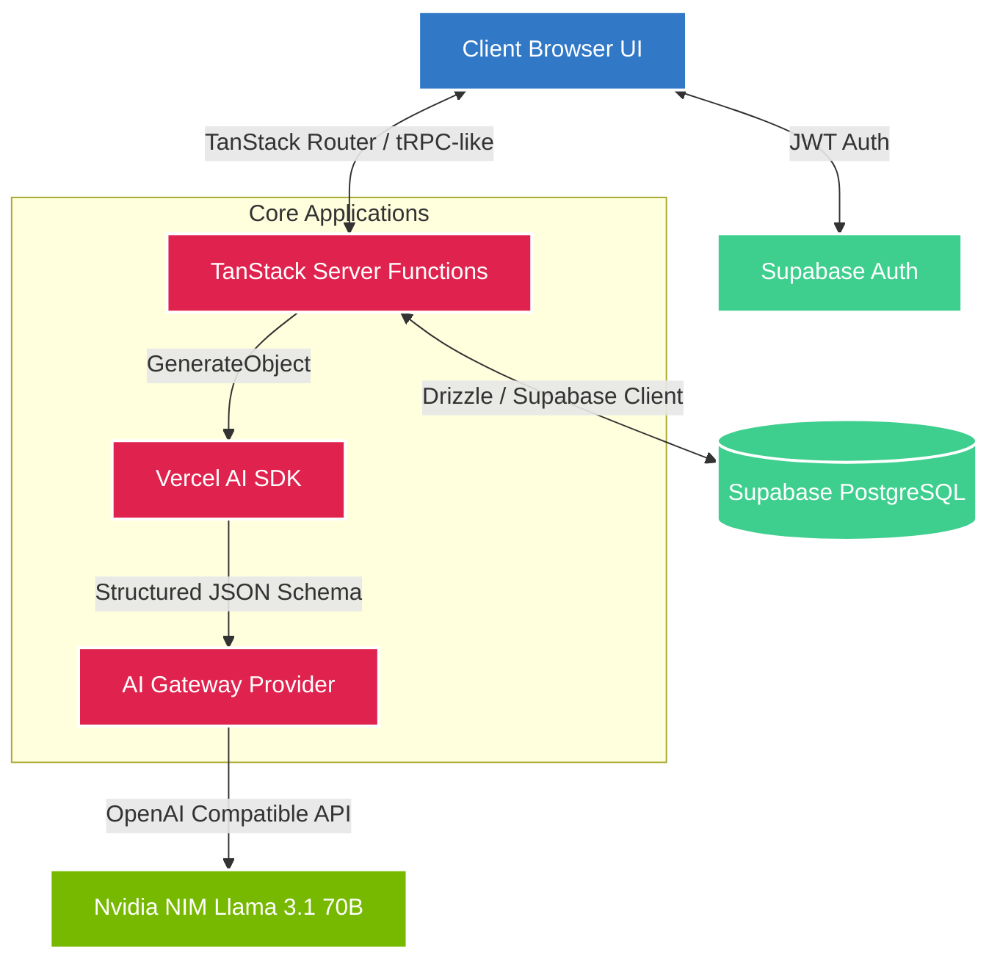

# 🕵️‍♂️ ML Inspector Suite


ML Inspector Suite is a comprehensive toolkit for AI/ML engineers to audit, evaluate, and debug modern LLM and RAG pipelines. Built with TanStack Start, Vercel AI SDK, and powered by Nvidia NIM (Llama 3.1 70B), this suite provides a unified dashboard for responsible AI development.

---

## 🏗️ System Architecture

The application is built on a modern server-side rendered architecture using TanStack Start and Supabase for persistence. The AI workloads are routed through a unified AI Gateway to Nvidia NIM using strict JSON Schemas for predictable structured outputs.



---

## ✨ Core Tools

1. 🔍 **RAG Debugger**: Evaluate retrieval pipelines for grounding, hallucination, and chunk relevance using a specialized judge LLM.
2. 📝 **Model Cards**: Automatically generate highly detailed, HuggingFace/Google-compatible Model Cards based on minimal engineering context.
3. 🧪 **Prompt Tester**: Systematically test system prompts across various test cases and evaluate responses using an LLM-as-a-judge.
4. 🏆 **Benchmarks**: Run multi-model benchmarking suites (e.g., comparing reasoning capabilities across Llama 3.1, Gemini, Claude).
5. 🔪 **Chunking Simulator**: Test different text splitting strategies (Fixed, Sliding, Sentence, Paragraph) and evaluate their retrieval performance.
6. ⚖️ **Bias Auditor**: Automatically scan datasets and model outputs for demographic bias and toxicity.
7. 💸 **Cost Estimator**: Calculate projected token costs for production RAG and LLM deployments.
8. 📊 **Audit Reports**: Generate PDF compliance reports for AI safety and enterprise regulations.

---

## 🚀 Getting Started

### Prerequisites
- Node.js 22+ (or Bun)
- A Supabase project
- An Nvidia API Key (for NIM access)

### Environment Variables
Create a `.env` file in the root directory:
```env
VITE_SUPABASE_URL=your_supabase_url
VITE_SUPABASE_ANON_KEY=your_supabase_anon_key
OPENAI_API_KEY=your_nvidia_nim_api_key
```

### Installation
```bash
npm install
# Start the development server
npm run dev
```
Navigate to `http://localhost:5173` to access the suite!

---

## 🛠️ Tech Stack

- **Framework:** TanStack Start (React 19 + SSR)
- **AI Integration:** Vercel AI SDK 
- **LLM Provider:** Nvidia NIM (`meta/llama-3.1-70b-instruct`)
- **Database & Auth:** Supabase (PostgreSQL)
- **Styling:** TailwindCSS v4 + Radix UI Primitives
- **Schema Validation:** Zod + Zod-to-JSON-Schema
